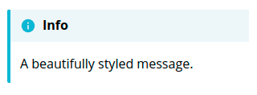
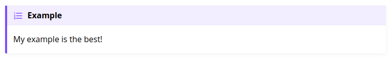
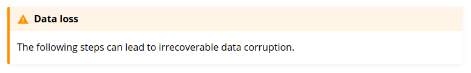
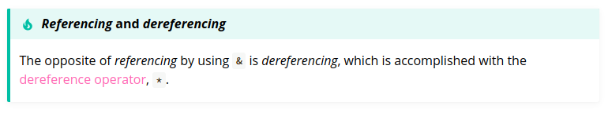
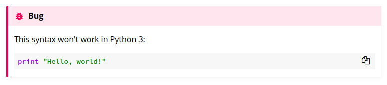

# mdbook-admonish

[](https://crates.io/crates/mdbook-admonish)
[](https://docs.rs/mdbook-admonish)

A preprocessor for [mdbook](https://github.com/rust-lang-nursery/mdBook) to add [Material Design](https://material.io/design) admonishments,
based on the [mkdocs-material](https://squidfunk.github.io/mkdocs-material/reference/admonitions/) implementation.

It turns this:

````
```admonish info
A beautifully styled message.
```
````

into this:



## Usage

Use any [fenced code-block](https://spec.commonmark.org/0.30/#fenced-code-blocks) as you normally would, but annotate it with `admonish <admonition type>`:

````
```admonish example
My example is the best!
```
````



See the [mkdocs-material docs](https://squidfunk.github.io/mkdocs-material/reference/admonitions/#supported-types) for a list of supported admonitions. You'll find:

- `info`
- `warning`
- `danger`
- `example`

and quite a few more!

### Additional Options

A custom title can be provided, contained in a double quoted JSON string:

````
```admonish warning "Data loss"
The following steps can lead to irrecoverable data corruption.
```
````



You can also leave out the admonition type altogether, in which case it will default to `note`:

````
```admonish
A plain note.
```
````


Markdown and HTML can be used in the inner content, as you'd expect:

````
```admonish tip "_Referencing_ and <i>dereferencing</i>"
The opposite of *referencing* by using `&` is *dereferencing*, which is
accomplished with the <span style="color: hotpink">dereference operator</span>, `*`.
```
````



If you have code blocks you want to include in the content,
use [tildes for the outer code fence](https://spec.commonmark.org/0.30/#fenced-code-blocks):

````
~~~admonish bug
This syntax won't work in Python 3:
```python
print "Hello, world!"
```
~~~
````



## Installation

Install the tool:

```bash
cargo install mdbook-admonish
```

Then let `mdbook-admonish` add the required files and configuration:

```bash
mdbook-admonish install path/to/your/book

# optionally, specify a directory where CSS files live, relative to the book root
mdbook-admonish install --css-dir ./assets/css .
```

This will add the following configuration to your `book.toml`:

```toml
[preprocessor.admonish]
command = "mdbook-admonish"

[output.html]
additional-css = ["./mdbook-admonish.css"]
```

and copy the file `mdbook-admonish.css` into your book's directory.

Then, build your book as usual:

```bash
mdbook path/to/book
```

### Updates

**Please note**, when updating your version of `mdbook-admonish`, updated styles
will not be applied unless you rerun `mdbook-admonish install` to update the additional
CSS files in your book.

## Development

Project design

- Compiled CSS styles are built and committed from SCSS sources. See the `compile_assets` folder for details.
- `mdbook-admonish install` is responsible for delivering additional assets and configuration to a client book.
- `mdbook-admonish` is responsible for preprocessing book data, adding HTML that references compiled classnames.

## Thanks

This utility is heavily drawn from and inspired by other projects, namely:

- [mdbook-mermaid](https://github.com/badboy/mdbook-mermaid)
- [mkdocs-material](https://github.com/squidfunk/mkdocs-material)
- [material-design-icons](https://github.com/google/material-design-icons)

The licences for these projects are included in the `licences` folder.
